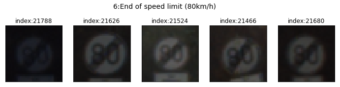

#**Traffic Sign Recognition**

This is SelfDrivingCar Nanodegree second project report.

---

**Build a Traffic Sign Recognition Project**

The goals / steps of this project are the following:
* Load the data set
* Explore, summarize and visualize the data set
* Design, train and test a model architecture
* Use the model to make predictions on new images
* Analyze the softmax probabilities of the new images
* Summarize the results with a written report

### Data Set Summary & Exploration


#### 1. Basic summary

I used the pandas library to calculate summary statistics of the traffic signs data set.
The results are shown here.

```
Number of training examples = 34799
Number of validation examples = 4410
Number of testing examples = 12630
Image data shape = (32, 32)
Number of classes = 43

Ratio of validation examples by training examples = 0.13
Ratio of test examples by training examples = 0.36
```

#### 2. Simple EDA

##### Frequency of sign example
Here is an exploratory visualization of the data set. It is a bar chart showing how many examples in each class for each different dataset. Examples of classes are not uniform but the distribution of training, validation and test dataset are approximately same.

Figure 1: Frequency of examples in each class.

##### Sign examples
Image examples of training dataset are shown here.





Figure 2: Examples from training dataset.

In the given dataset, the position of signs are centered and the sizes are almost same. Images have different brightness and some image is very dark and it is difficult to identify the sign by just looking.


Figure 3: Very low contrast image. It seems difficult to identify its class.

### Design and Test a Model Architecture

#### 1. preprocessing

I applied the following preprocessing

1. Normalization
2. Grayscale Convert
3. Histogram Equalization
4. Data augmentation

##### 1. Normalization

The training, validation and test data are normalized by the following method

$$
  X' = \frac{X - X_{min}}{(X_{max} - X_{min})},
$$

where $X_{max}$ and $X_{min}$ are maximum and minimum values of given image data $X$.

##### 2. Grayscale convert

While RGB image colors may be an important feature to identify their classes, many color variation may disturb the model training because of overfitting to the specific color image. Observing some examples of given images, I think that each sign can be identified in a grayscale image. I compared performance between grayscale and RGB colored models, but there is no noticeable improvement. However, it is considered that the grayscale convert may give the more robust model. So I decided to left the grayscale convert in the final model.

##### 3. Histogram equalization

As shown in Figure 3, there some images whose brightness are too low. Identification of such images should be difficult. To improve the contrast I applied equalization technique[^1]. Since the standard histogram equalization does not work when there exists bright spot in the background region, Contrast Limited Adaptive Histogram Equalization (CLAHE)[^2] is employed. Adaptive histogram equalization (AHE) takes into account the spatial non-uniformity of given image. In AHE,  given image is divided into some sub regions and the usual histogram equalization is applied to these subregions. CLAHE is a variation of AHE. CLAHE introduces a limitation of histogram frequency which improves the signal noise ratio of background (unimportant) region, where larger limitation value gives stronger contrast.


Figure 4: Comparison before and after preprocessed images.

[^1]:https://www.wikiwand.com/en/Histogram_equalization
[^2]:https://en.wikipedia.org/w/index.php?title=Adaptive_histogram_equalization)

##### 4. Data augmentation

In some trials and errors, I observed that my model tend to overfit the training data. In general, overfitting is suppressed when the number of data increases[^3]. Therefore, in order to improve my model performance, I introduce image data augmentation technique. Data augmentation make fake training data from original training data.

I generate additional training data by applying the following linear transformation.

$$
  X_{aug} = T(sx, sy, h, tx, ty) R(\theta) X_{orig},
$$
where $X_{orig}$ is original image data and $T(\theta)$ represent rotation with angle $\theta$ around the center of the image (Note: not around the upper-left corner $(x, y)=(0, 0)$). $T(sx, sy, h, tx, ty)$ is Affine transformation without rotation, where $sx, sy$ are x, y scale, $h$ is a shear angle in radians and $tx, ty$ are translation parameters. Each parameter is randomly generated by using scipy's `truncnorm` distribution[^4]. Used distribution parameters are given in the following table:

| parameter | min | max | loc | scale |
|-----------|-----|-----|-----|-------|
| $\theta$  | -10 | 10  | 0   | 5     |
| sx, xy    | 0.8 | 1.2 | 1.0 | 0.05  |
| h         | 0.2 | 0.2 | 0   | 0.05  |
| tx, ty    | -3  | 3   | 0   | 1     |
Table 1: Augmentation parameters

Examples of generated image are shown here.


Figure 5: Samples of data augmentation. Leftmost is an original image. Others are generated images.


[^3]:http://scikit-learn.org/stable/modules/learning_curve.html#learning-curve
[^4]:https://docs.scipy.org/doc/scipy/reference/generated/scipy.stats.truncnorm.html

I apply this augmentation technique to the training data belonging to the classes which have small examples (ex. less than `500`), the number of augmented data is `173995`, the total number of training data examples is `208794 (= 34799(original) + 173995 (augmented))`.

I did not many trial and error for augmentation size so that it is not clear what size of augmentation is optimal.

#### 2. Model architecture

My model architecture is shown by the following diagram.


Figure 6: Final model architecture.

The architecture is basically same as LeNet[^5]. I inserted dropout layers into each ReLu activation and added Batch normalization layers, which is indicated as `BN` in the diagram, after convolution layers.

[^5]:http://yann.lecun.com/exdb/publis/pdf/lecun-01a.pdf

#### 3. Model training and hyper parameters

To train the model, I used an `AdamOptimizer` a TensorFlow's built-in optimizer. Model parameters are updated for each mini batch. In each dropout layer, I used same dropout probability. In batch normalization layers, the update of batch normalization parameters is enabled only during training time. Finally, I used the following hyper parameters:

```
EPOCHS = 15
BATCH_SIZE = 64
rate = 0.001  # learning rate
enable_bach_norm = True
keep_probability = 0.7  # 1.0 - dropout probability
```

#### 4. Description of approach

My final model results were:
* training set accuracy of `0.972`
* validation set accuracy of `0.965`
* test set accuracy of `0.952`

I applied some different models and compared the results.
History of evaluation results for each model is shown here.


Figure 7: Time series of accuracies of different models.

Description of each model is followings.

##### model 1
First, according to the lecture, I used LeNet with modification of the input channel from 1 to 3 and the output class number from 10 to 43.
This model training and test accuracy reached `~0.98`(train) and `0.89`. The discrepancy between training and test accuracy indicates overfitting of the model.

##### model 2
I introduce batch normalization to the first model. I can observe a little improvement train and test accuracy, but overfitting still exists.

##### model 3
In order to fix overfitting. I introduce dropout layer into the original LeNet. Dropout layer makes increase the convergence time of accuracy but test accuracy rose to `~0.925` from `~0.90`.

##### model 4
I applied LCAHE transformation as a preprocessing. Model is same as previous one. This preprocessing improves training and test accuracies `~0.98`(train) and `~0.94`(test).

##### model 5
In addition to the LCAHE, pixel value is normalized into the range of [0, 1.0]. This gives no noticeable improvement, but a little reduction of fluctuation of accuracy is observed.

##### model 6
Now the accuracy of test data is over `0.93`. but there is overfitting behavior still observed. I applied data augmentation technique. This decrease the training accuracy from `0.98` to `0.97`, but the discrepancy between training and test accuracy is reduced.

##### model 7
As discussed preprocessing section, I added grayscale convert to the model. This makes no significant improvement. But I decide to include the grayscale convert, since I considered that the grayscale convert may give the more robust model.

### Test a Model on New Images

#### 1. Test with collected German traffic signs

Here are five German traffic signs that I found on the web:


Figure 8: Newly collected images.

The first image (33:turn_right_ahead) might be typical, and it should be identified easily. The second image (8:speed_limit_120) is not typical, since the background color of number is a reddish color, while typical color is white. The third example (23:slippery_road) is unclear. This is difficult to identify the inner graphics for me. The fourth example (13:yield) is a clear sign, but it has an irrelevant number under the sign which may mislead the model. The last image is not clear but typical.

#### 2. About prediction results for new traffic signs.

Here are the results of the prediction:

|          Image          |       Prediction       |
|:------------------------|:-----------------------|
|   33:Turn right ahead   | 33:Turn right ahead    |
| 8:Speed limit (120km/h) | 40:roundabout mandatory|
|    23:Slippery road     |    23:Slippery road    |
|        13:Yield         |        13:Yield        |
|  41:End of no passing   |  41:End of no passing  
Table 2: Prediction and ground true comparison.

The accuracy of this prediction is 80 % (4/5). Comparing to the accuracy of the test set (>93%), the result is reasonable.

#### 3. Discussion of the prediction result of new images

The prediction probabilities for new images are shown in figure 9. The probabilities giving right predictions make clear single peaks, while the prediction of `8:speed_limit_120` image gives a completely wrong answer. In the misidentified case, the right answer (8:speed limit (120km/h)) is included top 5 and found at the fourth position, but it is a very low probability. In the failure case, the prediction (`40:roundabout mandatory`) has a same circular shape as a right sign, but its color and inner graphics are different. The character depicted in the input image seems to be sufficiently clear, so the reason of misidentification is not ambiguity. One possibility is that the background color of the character part is different from usual white. This modified the contrast between character and background region and disturb model prediction.


Figure 9: Top 5 softmax probabilities of five new images.

### Visualizing the Neural Network

Activation of model layers with specific image is visualized.


Figure 10: Visualization of activated layer. Input image which is preprocessed and activated first convolution are shown. Upper images are activated by `speed limit 120(km/h)` sign. Lower images are activated by `priority road` sign

Activated layers capture a different type of features of input images. For example, first, third and sixth feature maps (`FeatureMap 0, 2, 5`) seems to activated by the diagonal line structures of original input, while fourth and fifth feature maps (`FeatureMap 2` and `FeatureMap 4`) seems to reflect the horizontal and vertical line structures of input, respectively.
